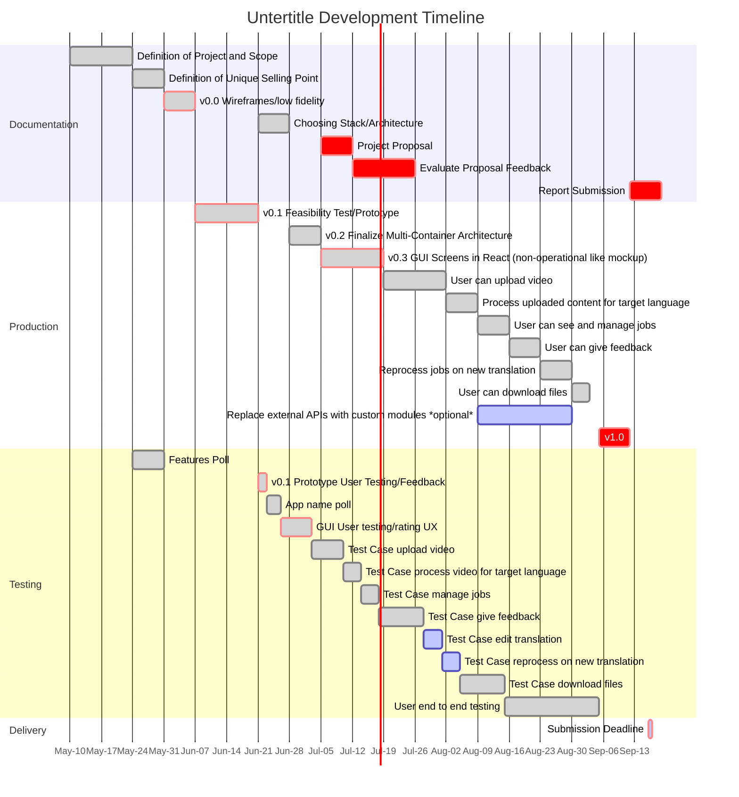

# UNTERTITLE

## 1. Introduction

### 1.1 Installation

#### Requirements

* Docker installed (and running)
* Browser

#### Startup

* Start Docker on your system and wait for it to initialize
* Change to the top level directory of the application, then create and start all containers with `docker-compose up`
* Wait until all containers have started up
* Access application at __localhost:7000__

## 2. Architecture

* Multiple Docker container, orchestrated via docker-compose

### 2.1 Components

#### 2.1.1 GUI
#### 2.1.2 Rest API
#### 2.1.3 Database
#### 2.1.4 Core

### 2.2 Shared Infrastructure

* Docker Volume

### 2.3 Overview

#### Overview Diagram

#### Class diagram

### 2.4 Sequences / Communication

#### FRONT END Sequence

#### BACK END Sequence

## 3. Project Plan

## 4. References and resources

# Teamwork repository
https://github.com/shiftbit/cm2020-agil-t1g0-xqr

# Project Proposal
https://www.dropbox.com/scl/fi/bfh3obt78t8tj5aqqitma/cm2020-agil-t1g0-xqr.paper?dl=0&rlkey=b9n3j1h6gyypen7pqxlzb4zv8

# Final paper
https://www.dropbox.com/scl/fi/utpnar7woulw669mq15sp/Agile-Final-Assessment.paper?dl=0&rlkey=ird2whtbsjnw2evz37294iich
