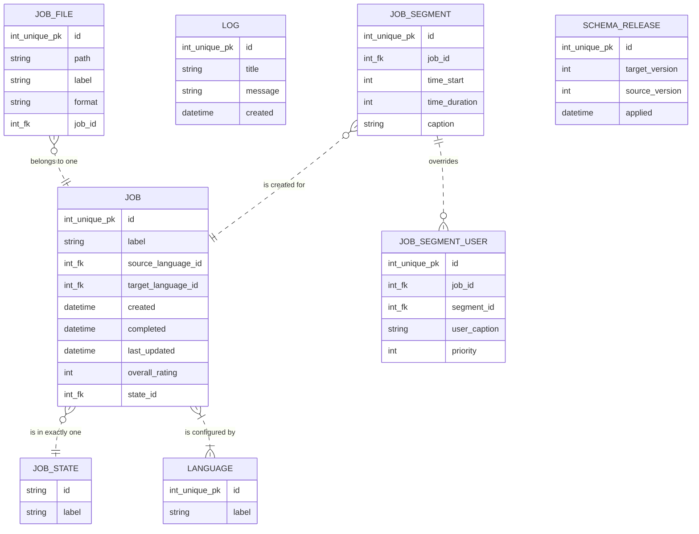

# DB Migration

## 1. Introduction
This folder contains separate folders for each iteration/release with release and rollback sql statements.
The initial release will create the __schema_release__ database table, which is used for keeping track of the currently deployed schema version.

Each release should consist of a folder named after the proper version, 
containing a __release.sql__ and a __rollback.sql__ file. 
Each of these files must contain the necessary statements for the schema 
change and also include __logging__ to the __schema_release__ table. 


## 2. How-To
Before applying a specific release, make sure to verify the current state by querying the release table in the database.

__Example:__
```sql
-- fetch current version
SELECT target_version FROM untertitle_db.schema_release ORDER BY applied DESC LIMIT 1;
```

### 2.1 Release
Apply the file(s) in ascending order, starting with the next release after the one currently deployed.

```
mysql -u ut -p untertitle_db < release.sql
```

### 2.2 Rollback
Rollback each release separately, starting with the currently deployed version.

```
mysql -u ut -p untertitle_db < release-XXX/rollback.sql
```

#### Note:
A script will be available in the future for a more convenient handling of releases/rollbacks.


## 3. Entity Relationship Model



## 4. Release Notes

### release-001
Create __schema-release__ table and its first entry.

### release-002
Setup complete table structure

### release-003
Fill language and state tables
